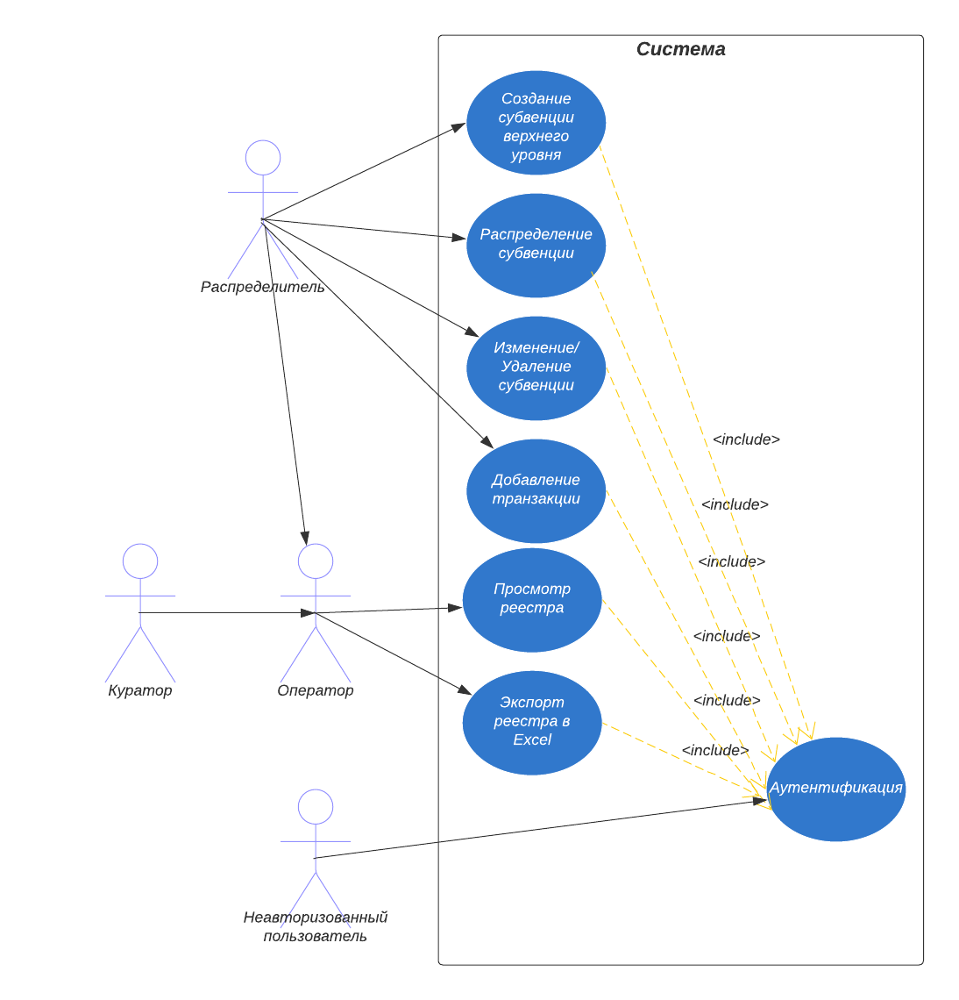

# Сценарии использования

## Аутентификация

### Акторы
 - Система
 - Неаутентифицированный пользователь (далее просто "Пользователь")

### Описание
Пользователь входит в систему для работы, соотвествующей его *роли*.

Возможные *роли* пользователя:
 - Распределитель
 - Куратор
 - Подписант

Количество попыток входа неограничено.

При успешной проверке данных, создается сессия с пользователем, имеющая ограниченное время действия. После истечения этого времени, пользователь теряет доступ ко всем функциям системы (за исключением *аутентификации*) и должен произвести *аутентификацию* заново.

### Предусловия
Пользователь должен получить данные для входа от администратора системы.

### Постусловия
Пользователь аутентифицирован.

| Действие пользователя | Отклик системы |
| ------------- | ------------- |
| 1. Пользователь заполняет поля "Логин" и "Пароль" | |
| 2. Пользователь инициирует вход в систему | 3. Система создает сессию с пользователем |
| | 4.	Система предоставляет пользователю доступ к просмотру реестра и функциям системы, доступным его роли |

## Просмотр реестра

### Акторы
 - Система
 - Пользователь (Распределитель, Куратор или Подписант)

### Предусловия
 - Пользователь аутентифицирован
 - Пользователь имеет доступ к просмотру реестра

### Описание
Пользователь просматривает список субвенций, **доступных пользователю**, (субвенции, получателем или распределителем которых является организация пользователя или её дочерняя организация), раскрывает карточку субвенции или фильтрует записи реестра.

| Действие пользователя | Отклик системы |
| ------------- | ------------- |
| 1.	Пользователь выбирает запись в реестре | |
| 2.	Пользователь инициирует раскрытие учётной карточки выбранной записи | 3.	Система предоставляет пользователю учётную карточку для просмотра |

### Альтернативные сценарии
1а. Пользователь задаёт критерии фильтрации.

2а. Система предоставляет пользователю записи реестра в отфильтрованном виде согласно заданным критериям.

После пп. 1а, 2а прецедент продолжается в пункте 1.

## Создание субвенции верхнего уровня

### Акторы
 - Система
 - Пользователь (Распределитель)

### Предусловия
 - Пользователь аутентифицирован
 - Пользователь имеет доступ к ведению реестра
 - Пользователь принадлежит организации верхнего уровня

### Описание
Пользователь, имеющий доступ к ведению реестра и принадлежащий к *организации верхнего уровня* может создать *субвенцию верхнего уровня*.

> *Организация верхнего уровня* - это такая организация, у которой нет родительской.

> *Субвенция верхнего уровня* - это такая субвенция, у которой нет родительской субвенции. Распределителем такой субвенции всегда является организация верхнего уровня.

Получателем должна быть дочерняя организация.

Распределителем устанавливается организация пользователя.

| Действие пользователя | Отклик системы |
| ------------- | ------------- |
| 1. Пользователь инициирует добавление новой субвенции верхнего уровня | 2.	Система предоставляет пользователю новую учётную карточку для заполнения |
| 3.	Пользователь заполняет поля "Получатель субвенции", "Год, на который выдана субвенция", "Объём выданных денежных средств" | |
| 4.	Пользователь инициирует сохранение введённых данных в реестре | 5. Система заполняет поля "Муниципальное образование" и "Распределитель субвенции" данными, связанными с пользователем |
| | 6. Система сохраняет данные в реестре |

## Распределение субвенции

### Акторы
 - Система
 - Пользователь (Распределитель)

### Предусловия
 - Пользователь аутентифицирован
 - Пользователь имеет доступ к ведению реестра

### Описание
Пользователь может распределить субвенцию, которая была распределена организации, к которой он принадлежит, либо её дочерней организации.

Сумма объёмов выданных денежных средств всех дочерних субвенций (включая создаваемую в этом сценарии) не должна превышать объём выданных денежных средств родительской субвенции.

Организация, являющаяся получателем создаваемой субвенции, должна быть дочерней организацией получателя распределяемой.

Организация пользователя должна быть получателем распределяемой субвенции или родительской организацией получателя.

| Действие пользователя | Отклик системы |
| ------------- | ------------- |
| 1. Пользователь выбирает в реестре субвенцию, которая будет являться родительской для создаваемой | |
| 2. Пользователь инициирует распределение выбранной субвенции | 3. Система предоставляет пользователю новую учётную карточку для заполнения |
| 4.	Пользователь заполняет поля "Получатель субвенции", "Год, на который выдана субвенция", "Объём выданных денежных средств" | |
| 5.	Пользователь инициирует сохранение введённых данных в реестре | 6. Система заполняет поля "Муниципальное образование" и "Распределитель субвенции" данными, связанными с пользователем |
| | 7. Система сохраняет данные в реестре | |

## Изменение/удаление субвенции

### Акторы
 - Система
 - Пользователь (Распределитель)

### Предусловия
 - Пользователь аутентифицирован
 - Пользователь имеет доступ к ведению реестра

### Описание
Пользователь может удалить или изменить некоторую субвенцию.

| Действие пользователя | Отклик системы |
| ------------- | ------------- |
| 1.	Пользователь выбирает запись в реестре | |
| 2.	Пользователь инициирует раскрытие учётной карточки выбранной записи | 3.	Система предоставляет пользователю учётную карточку для просмотра и изменения |
| 4. Пользователь изменяет данные полей "Получатель субвенции", "Год, на который выдана субвенция", "Объём выданных денежных средств" | |
| 5.	Пользователь инициирует сохранение введённых данных в реестре | 6. Система сохраняет данные в реестре |

### Альтернативные сценарии
1а. Пользователь выбирает запись в реестре.

2а. Пользователь инициирует удаление выбранной записи из реестра.

3а. Система удаляет запись из реестра.

## Добавление транзакции

### Описание
Пользователь может совершить транзакцию, использовав денежные средства, предоставленные субвенцией.

### Предусловия
 - Пользователь аутентифицирован
 - Пользователь имеет доступ к ведению реестра

| Действие пользователя | Отклик системы |
| ------------- | ------------- |
| 1.	Пользователь выбирает запись в реестре | |
| 2.	Пользователь инициирует раскрытие учётной карточки выбранной записи | 3.	Система предоставляет пользователю учётную карточку выбранной записи |
| 4. Пользователь инициирует создание новой транзакции | 5. Система предоставляет пользователю форму для создания новой транзакции |
| 6. Пользователь заполняет поля "Объём транзакции" и "Дата совершения транзакции" | |
| 7. Пользователь инициирует совершение транзакции | 8. Система сохраняет данные транзакции в реестре |

## Экспорт реестра в Excel

### Описание
Пользователь может экспортировать записи реестра в файл MS Excel.

### Предусловия
 - Пользователь аутентифицирован
 - Пользователь имеет доступ к просмотру реестра

| Действие пользователя | Отклик системы |
| ------------- | ------------- |
| 1.	Пользователь инициирует экспорт записей реестра | 2. Система экспортирует записи реестра в файл MS Excel |
| | 3. Система отображает пользователю созданный MS Excel файл для работы |

### Альтернативные сценарии
1а. Пользователь задаёт критерии фильтрации.

2а. Система предоставляет пользователю записи реестра в отфильтрованном виде согласно заданным критериям.

После пп. 1а, 2а прецедент продолжается в пункте 1.
